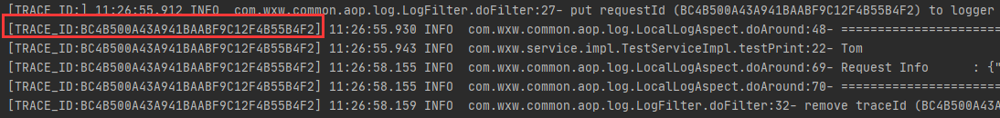

### AOP 文档

### 1. 业务抢先看

#### 1.1 AOP 日志捕捉

- 访问 URl：` http://localhost:8080/aop/test?name=Tom&age=18`  

- 捕捉日志详情：

  ```json
  {
      "classMethodName":"com.wxw.service.impl.TestServiceImpl.testPrint",
      "createDate":"2021-03-23 11:26:57",
      "endTime":"2021-03-23 11:26:57",
      "httpMethod":"GET",
      "remoteIp":"127.0.0.1",
      "requestParams":{
          "name":"Tom",
          "age":18
      },
      "requestUrl":"http://localhost:8080/aop/test",
      "resultMsg":"成功",
      "runStatus":"SUCCESS",
      "runTime":"2063ms",
      "startTime":"2021-03-23 11:26:55",
      "sysLogMsg":"",
      "sysLogVal":2020
  }
  ```

- 使用 traceId 链路跟踪 整条调用链，方便定位和分析上下游的具体情况

   

### 2. 技术攻坚

#### 1.1  JoinPoint 

**JoinPoint**对象**封装了SpringAop中切面方法的信息**,在切面方法中添加**JoinPoint参数**,就可以获取到封装了该方法信息的**JoinPoint对象** 

| 方法名                    | 功能                                                         |
| ------------------------- | ------------------------------------------------------------ |
| Signature getSignature(); | **获取封装了署名信息的对象,在该对象中可以获取到目标方法名,所属类的Class等信息** |
| Object[] getArgs();       | **获取传入目标方法的参数对象**                               |
| Object getTarget();       | **获取被代理的对象**                                         |
| Object getThis();         | **获取代理对象**                                             |

- **ProceedingJoinPoint对象** 

> ProceedingJoinPoint对象是JoinPoint的子接口,该对象只用在@Around的切面方法中

- `Object proceed() throws Throwable //执行目标方法` 
- `Object proceed(Object[] var1) throws Throwable //传入的新的参数去执行目标方法` 

案例参考：https://blog.csdn.net/qq_15037231/article/details/80624064


**相关文章** 

1. [高并发下写个日志请求切面，前后端甩锅更方便](https://juejin.cn/post/6844904087964614670)  