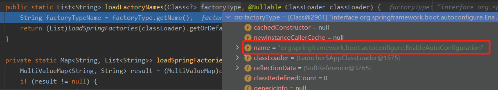
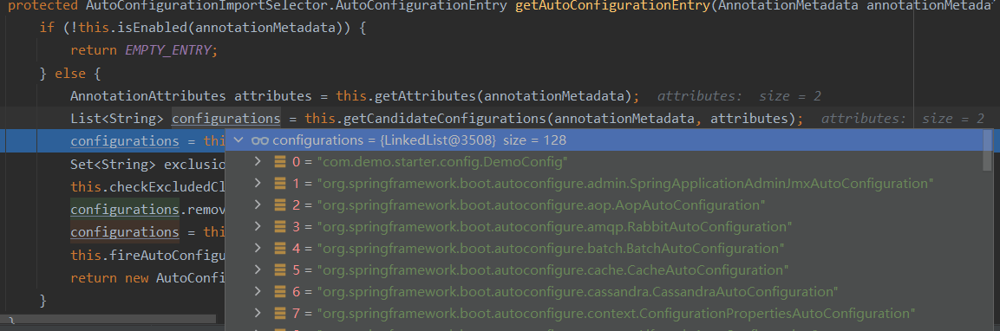
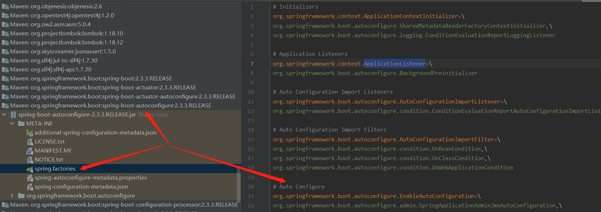
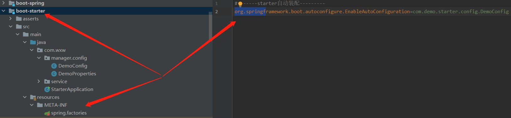
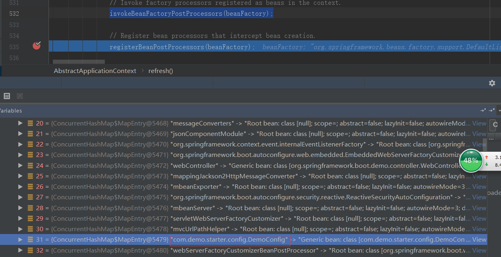

### Boot-starter 自定义一个starter


### 码前必备知识

#### 1. springboot stater 机制

SpringBoot中的starter是一种非常重要的机制，能够抛弃以前繁杂的配置，将其统一集成进starter，应用者只需要在maven中引入starter依赖，SpringBoot就能自动扫描到要加载的信息并启动相应的默认配置。

starter让我们摆脱了各种依赖库的处理，需要配置各种信息的困扰。SpringBoot会自动通过classpath路径下的类发现需要的Bean，并注册进IOC容器。SpringBoot提供了针对日常企业应用研发各种场景的spring-boot-starter依赖模块。所有这些依赖模块都遵循着约定成俗的默认配置，并允许我们调整这些配置，即遵循“约定大于配置”的理念。

#### 2. 为什么要自定义 stater

在我们的日常开发工作中，经常会有一些独立于业务之外的配置模块，我们经常将其放到一个特定的包下，然后如果另一个工程需要复用这块功能的时候，需要将代码硬拷贝到另一个工程，重新集成一遍，麻烦至极。如果我们将这些可独立于业务代码之外的功配置模块封装成一个个starter，复用的时候只需要将其在pom中引用依赖即可，SpringBoot为我们完成自动装配，简直不要太爽。

#### 3. 重要注解

-   **@ConditionalOnProperty 注解** 

  控制 @Configuration 是否生效。简单来说也就是我们可以通过在yml配置文件中控制 @Configuration 注解的配置类是否生效。

- @EnableConfigurationProperties 注解 

  用来开启对3步骤中 @ConfigurationProperties 注解配置Bean的支持。也就是@EnableConfigurationProperties注解告诉Spring Boot 能支持@ConfigurationProperties。

### SpringBoot 自动装配原理

对这个注解详细大家一定非常熟悉了。再来好好看看这个注解。

```java
@Target({ElementType.TYPE})
@Retention(RetentionPolicy.RUNTIME)
@Documented
@Inherited
@SpringBootConfiguration
@EnableAutoConfiguration
@ComponentScan(
    excludeFilters = {@Filter(
    type = FilterType.CUSTOM,
    classes = {TypeExcludeFilter.class}
), @Filter(
    type = FilterType.CUSTOM,
    classes = {AutoConfigurationExcludeFilter.class}
)}
)
public @interface SpringBootApplication {
    .....
}
```

接着看@EnableAutoConfiguration

```java
@Target({ElementType.TYPE})
@Retention(RetentionPolicy.RUNTIME)
@Documented
@Inherited
@AutoConfigurationPackage
@Import({AutoConfigurationImportSelector.class})
public @interface EnableAutoConfiguration {
    ......
}
```

　OK，看到 @Import(AutoConfigurationImportSelector.class)导入了一个重要的类AutoConfigurationImportSelector。

#### 1. AutoConfigurationImportSelector类

> org.springframework.boot.autoconfigure.AutoConfigurationImportSelector

 ```java
 // 选择导入注解配置
 @Override
 public String[] selectImports(AnnotationMetadata annotationMetadata) {
     if (!isEnabled(annotationMetadata)) {
         return NO_IMPORTS;
     }
     // 获取自动配置
     AutoConfigurationEntry autoConfigurationEntry = getAutoConfigurationEntry(annotationMetadata);
     return StringUtils.toStringArray(autoConfigurationEntry.getConfigurations());
 }
 ```

```java
protected AutoConfigurationEntry getAutoConfigurationEntry(AnnotationMetadata annotationMetadata) {
    if (!isEnabled(annotationMetadata)) {
        return EMPTY_ENTRY;
    }
    AnnotationAttributes attributes = getAttributes(annotationMetadata);
    //获取所有的自动配置类（META-INF/spring.factories中配置的key为org.springframework.boot.autoconfigure.EnableAutoConfiguration的类）
    List<String> configurations = getCandidateConfigurations(annotationMetadata, attributes);
    configurations = removeDuplicates(configurations);
    //需要排除的自动装配类（springboot的主类上 @SpringBootApplication(exclude = {com.demo.starter.config.DemoConfig.class})指定的排除的自动装配类）
    Set<String> exclusions = getExclusions(annotationMetadata, attributes);
    checkExcludedClasses(configurations, exclusions);
    //将需要排除的类从 configurations remove掉
    configurations.removeAll(exclusions);
    configurations = getConfigurationClassFilter().filter(configurations);
    fireAutoConfigurationImportEvents(configurations, exclusions);
    return new AutoConfigurationEntry(configurations, exclusions);
}
```

至于怎么ConfigurationClassParser类中的parse() =>processDeferredImportSelectors()==>AutoConfigurationImportSelector#selectImports()，篇幅有限不做过多介绍。

```java
List<String> configurations = getCandidateConfigurations(annotationMetadata, attributes);
```

我们来看一下getCandidateConfigurations()方法是怎么拿到这些自动配置类的。

```java
protected List<String> getCandidateConfigurations(AnnotationMetadata metadata, AnnotationAttributes attributes) {
    List<String> configurations = SpringFactoriesLoader.loadFactoryNames(getSpringFactoriesLoaderFactoryClass(),
                                                                         getBeanClassLoader());
    Assert.notEmpty(configurations, "No auto configuration classes found in META-INF/spring.factories. If you "
                    + "are using a custom packaging, make sure that file is correct.");
    return configurations;
}
```

是不是又看到一个十分熟悉的方法loadFactoryNames()，没错，其实我们在分析SpringBoot启动流程的第一篇文章的时候，就已经分析了，SpringBoot是如何从META-INF/spring.factories中加载指定key的value的。ok，我们在这里再次回顾一遍。

#### 2. loadFactoryNames()

```java
public static List<String> loadFactoryNames(Class<?> factoryType, @Nullable ClassLoader classLoader) {
    String factoryTypeName = factoryType.getName();
    return (List)loadSpringFactories(classLoader).getOrDefault(factoryTypeName, Collections.emptyList());
}
```

debug，看看要从META-INF/spring.factories中加载的类的key，如下图所示：org.springframework.boot.autoconfigure.EnableAutoConfiguration

 

回到selectImports()方法，

debug，跳过List<String> configurations = getCandidateConfigurations(annotationMetadata,attributes); 看一下configurations

  

竟然有128个，那这些类都在哪里呢？

看spring-boot-autoconfigure（当然在SpringBoot的工程中，也不止这一个依赖包中存在该配置文件）工程下的META-INF/spring.factories，我们能看到org.springframework.boot.autoconfigure.EnableAutoConfiguration定义了一大堆。

 

其中还有一个com.demo.starter.config.DemoConfig是我自定义的starter。如下所示，我在测试工程中添加了自定义starter的依赖，所以SpringBoot就能扫描到。

```xml
<!--引入自定义的starter-->
<dependency>
    <groupId>com.wxw</groupId>
    <artifactId>boot-starter</artifactId>
    <version>1.0-SNAPSHOT</version>
</dependency>
```

 

继续看Set<String> exclusions = getExclusions(annotationMetadata, attributes);方法，该方法是排除主类上@SpringBootApplication注解上排除的自动装配的类。

比如：我们在该注解上排除我们自定义starter的自动装配的类，@SpringBootApplication(exclude = {com.demo.starter.config.DemoConfig.class})（当然也可以用excludeName进行排除），那么在后面的configurations.removeAll(exclusions);方法中将会删除我们的com.demo.starter.config.DemoConfig.class。

```java
// 该行代码将会过滤掉不需要装配的类。过滤的逻辑有很多，比如我们常用的@ConditionXXX注解。
configurations = filter(configurations, autoConfigurationMetadata); 
```

```xml
@ConditionalOnBean:容器中有指定的Bean
@ConditionalOnClass：当类路径下有指定的类
@ConditionalOnExpression:基于SpEL表达式作为判断条件
@ConditionalOnJava:基于JVM版本作为判断条件
@ConditionalOnJndi:在JNDI存在的条件下查找指定的位置
@ConditionalOnMissingBean:当容器中没有指定Bean的情况下
@ConditionalOnMissingClass:当类路径下没有指定的类
@ConditionalOnNotWebApplication:当前项目不是Web项目
@ConditionalOnProperty:配置文件中指定的属性是否有指定的值
@ConditionalOnResource:类路径下是否有指定的资源
@ConditionalOnSingleCandidate:当指定Bean在容器中只有一个，或者虽然有多个但是指定首选Bean
@ConditionalOnWebApplication:当前项目是Web项目的条件下
```

至于如何将这些类解析成BeanDefinition并注册进beanDefinition中的，和上一节讲的过程是一样的，

debug，跳过refresh()方法中的invokeBeanFactoryPostProcessors(beanFactory);方法。

如下图所示，最终在beanFactory的BeanDefinitionMap中找到了自定义starter中的自动装配的类。

 

到此IoC容器的初始化过程就结束了

**相关文章**

1. [自定义 spring boot starter ](https://www.cnblogs.com/hello-shf/p/10864977.html) 
2. [SpringBoot自动装配原理实现](https://www.cnblogs.com/hello-shf/p/11057861.html) 

