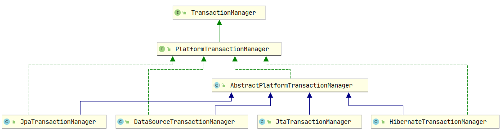

##  SpringBoot 与 事务 

---


## SpringBoot 事务基础

> 先思考一番

1. 做框架、做通用组件，做大的难处是什么？
   - 需要适用于不同的情况，通用性
   - 提供给使用者最好是同样的用法
2. 事务框架它要应对多种情况吗？事务管理会有多种不同的管理情况吗？
   - MyBatis  DataSource
   - JDBC编程  DataSource
   - Hibernates  SpringHibernateTransactionalManager   DataSource
   - Jpa  基于Hibernates
   - 多数据源    JTA
3. 如果你是框架开发者，你如何处理应对多种情况？
   - 设计——>易扩展、复用代码、少写代码、设计模式
   - 抽象、封装、继承、面向接口编程
4. 实现事务无非需要三步
   1. 开启事务
   2. 执行业务操作
   3. 提交/回滚事务
### 1. 初步理解

事务相信大家都不陌生，在企业级应用程序开发中，事务管理必不可少的技术，用来确保数据的完整性和一致性。 
事务有四个特性：ACID

- 原子性（Atomicity）
- 一致性（Consistency）
- 隔离性（Isolation）
- 持久性（Durability）

### 2. 事务管理器

Spring并不直接管理事务，而是提供了多种事务管理器，他们将事务管理的职责委托给Hibernate或者JTA等持久化机制所提供的相关平台框架的事务来实现。 

Spring事务管理器的接口是org.springframework.transaction.PlatformTransactionManager，通过这个接口，Spring为各个平台如JDBC、Hibernate等都提供了对应的事务管理器，但是具体的实现就是各个平台自己的事情了，这样设计更具有通用性，此接口的内容如下：

 

```java
Public interface PlatformTransactionManager()...{  
    // 由TransactionDefinition得到TransactionStatus对象
    TransactionStatus getTransaction(TransactionDefinition definition) throws TransactionException; 
    // 提交
    Void commit(TransactionStatus status) throws TransactionException;  
    // 回滚
    Void rollback(TransactionStatus status) throws TransactionException;  
    } 
```

从这里可知具体的具体的事务管理机制对Spring来说是透明的，它并不关心各个平台怎么实现，所以Spring事务管理的一个优点就是：为不同的事务API，提供一致的编程模型（更具有通用性），如JTA、JDBC、Hibernate、JPA。下面分别介绍各个平台框架实现事务管理的机制。

#### 2.1 JDBC 事务

如果应用程序中直接使用JDBC来进行持久化，DataSourceTransactionManager会为你处理事务边界。为了使用DataSourceTransactionManager，你需要使用如下的XML将其装配到应用程序的上下文定义中：

```xml
<bean id="transactionManager" class="org.springframework.jdbc.datasource.DataSourceTransactionManager">
    <property name="dataSource" ref="dataSource" />
</bean>
```

实际上，DataSourceTransactionManager是通过调用java.sql.Connection来管理事务，而后者是通过DataSource获取到的。通过调用连接的commit()方法来提交事务，同样，事务失败则通过调用rollback()方法进行回滚。

#### 2.2 Hibernate事务

如果应用程序的持久化是通过Hibernates实现的，那么你需要使用HibernateTransactionManager。对于Hibernate3，需要在Spring上下文定义中添加如下的`<bean>`声明：

```xml
<bean id="transactionManager" class="org.springframework.orm.hibernate3.HibernateTransactionManager">
    <property name="sessionFactory" ref="sessionFactory" />
</bean>
```

sessionFactory属性需要装配一个Hibernate的session工厂，

- HibernateTransactionManager的实现细节是它将事务管理的职责委托给org.hibernate.Transaction对象，
- sessionFactory是从Hibernate Session中获取到的。当事务成功完成时，HibernateTransactionManager将会调用Transaction对象的commit()方法，反之，将会调用rollback()方法。

#### 2.3 Java持久化API事务（JPA）

Hibernate多年来一直是事实上的Java持久化标准，但是现在Java持久化API作为真正的Java持久化标准进入大家的视野。如果你计划使用JPA的话，那你需要使用Spring的JpaTransactionManager来处理事务。你需要在Spring中这样配置JpaTransactionManager：

```xml
<bean id="transactionManager" class="org.springframework.orm.jpa.JpaTransactionManager">
    <property name="sessionFactory" ref="sessionFactory" />
</bean>
```

JpaTransactionManager只需要装配一个JPA实体管理工厂（javax.persistence.EntityManagerFactory接口的任意实现）。JpaTransactionManager将与由工厂所产生的JPA EntityManager合作来构建事务。

#### 2.4 Java原生API事务

如果你没有使用以上所述的事务管理，或者是跨越了多个事务管理源（比如两个或者是多个不同的数据源），你就需要使用JtaTransactionManager：

```xml
<bean id="transactionManager" class="org.springframework.transaction.jta.JtaTransactionManager">
    <property name="transactionManagerName" value="java:/TransactionManager" />
</bean>
```

JtaTransactionManager将事务管理的责任委托给javax.transaction.UserTransaction和javax.transaction.TransactionManager对象，其中事务成功完成通过UserTransaction.commit()方法提交，事务失败通过UserTransaction.rollback()方法回滚。

### 3. 事务特性

上面讲到的事务管理器接口PlatformTransactionManager通过getTransaction(TransactionDefinition definition)方法来得到事务，这个方法里面的参数是TransactionDefinition类，这个类就定义了一些基本的事务属性。 

那么什么是事务属性呢？事务属性可以理解成事务的一些基本配置，描述了事务策略如何应用到方法上。事务属性包含了5个方面，如图所示：

 

TransactionDefinition接口内容如下：

```java
public interface TransactionDefinition {
    int getPropagationBehavior(); // 返回事务的传播行为
    int getIsolationLevel(); // 返回事务的隔离级别，事务管理器根据它来控制另外一个事务可以看到本事务内的哪些数据
    int getTimeout();  // 返回事务必须在多少秒内完成
    boolean isReadOnly(); // 事务是否只读，事务管理器能够根据这个返回值进行优化，确保事务是只读的
} 
```

我们可以发现TransactionDefinition正好用来定义事务属性，下面详细介绍一下各个事务属性。

#### 3.1 传播行为

事务的第一个方面是传播行为（propagation behavior）。当事务方法被另一个事务方法调用时，必须指定事务应该如何传播。

例如：方法可能继续在现有事务中运行，也可能开启一个新事务，并在自己的事务中运行。

Spring定义了七种传播行为：

| 传播行为                  | 含义                                                         |
| ------------------------- | ------------------------------------------------------------ |
| PROPAGATION_REQUIRED      | 表示当前方法必须运行在事务中。如果当前事务存在，方法将会在该事务中运行。否则，会启动一个新的事务 |
| PROPAGATION_SUPPORTS      | 表示当前方法不需要事务上下文，但是如果存在当前事务的话，那么该方法会在这个事务中运行 |
| PROPAGATION_MANDATORY     | 表示该方法必须在事务中运行，如果当前事务不存在，则会抛出一个异常 |
| PROPAGATION_REQUIRED_NEW  | 表示当前方法必须运行在它自己的事务中。一个新的事务将被启动。如果存在当前事务，在该方法执行期间，当前事务会被挂起。如果使用JTATransactionManager的话，则需要访问TransactionManager |
| PROPAGATION_NOT_SUPPORTED | 表示该方法不应该运行在事务中。如果存在当前事务，在该方法运行期间，当前事务将被挂起。如果使用JTATransactionManager的话，则需要访问TransactionManager |
| PROPAGATION_NEVER         | 表示当前方法不应该运行在事务上下文中。如果当前正有一个事务在运行，则会抛出异常 |
| PROPAGATION_NESTED        | 表示如果当前已经存在一个事务，那么该方法将会在嵌套事务中运行。嵌套的事务可以独立于当前事务进行单独地提交或回滚。如果当前事务不存在，那么其行为与PROPAGATION_REQUIRED一样。注意各厂商对这种传播行为的支持是有所差异的。可以参考资源管理器的文档来确认它们是否支持嵌套事务 |

*注：以下具体讲解传播行为的内容参考自Spring事务机制详解* 

（1）**propagation_required 级别，如果存在一个事务，则支持当前事务。如果没有事务则开启一个新的事务。** 

- 使用spring声明式事务，spring使用AOP来支持声明式事务，会根据事务属性，自动在方法调用之前决定是否开启一个事务，并在方法执行之后决定事务提交或回滚事务。

类似于这种实现：

```java
Main{ 
    Connection con=null; 
    try{ 
        con = getConnection();  // 获取连接
        con.setAutoCommit(false); // 关闭自动提交

        //方法调用
        methodB(); 

        //提交事务
        con.commit(); 
    } Catch(RuntimeException ex) { 
        //回滚事务
        con.rollback();   
    } finally { 
        //释放资源
        closeCon(); 
    } 
} 
```

- Spring 保证在methodB方法中所有的调用都获得到一个相同的连接。在调用methodB时，没有一个存在的事务，所以获得一个新的连接，开启了一个新的事务。 单独调用MethodA时，在MethodA内又会调用MethodB.

执行效果相当于：

```java
main{ 
    Connection con = null; 
    try{ 
        con = getConnection(); 
        methodA(){
            // B 方法使用当前方法A的事务
            methodB();
        }
        con.commit(); 
    } catch(RuntimeException ex) { 
        con.rollback(); 
    } finally {    
        closeCon(); 
    }  
} 
```

调用MethodA时，环境中没有事务，所以开启一个新的事务.当在MethodA中调用MethodB时，环境中已经有了一个事务，所以methodB就加入当前事务。

（2）**progation_supports 如果存在一个事务，支持当前事务。如果没有事务，则非事务的执行。但是对于事务同步的事务管理器，PROPAGATION_SUPPORTS与不使用事务有少许不同。** 

```java
//事务属性 PROPAGATION_REQUIRED
methodA(){
  methodB();
}

//事务属性 PROPAGATION_SUPPORTS
methodB(){
  ……
}
```

单纯的调用methodB时，methodB方法是非事务的执行的。当调用methdA时,methodB则加入了methodA的事务中,事务地执行。

（3）**progation_mandatory 如果已经存在一个事务，支持当前事务。如果没有一个活动的事务，则抛出异常。** 

```java
//事务属性 PROPAGATION_REQUIRED
methodA(){
    methodB();
}

//事务属性 PROPAGATION_MANDATORY
    methodB(){
    ……
}
```

- 当单独调用methodB时，因为当前没有一个活动的事务，则会抛出异常throw new IllegalTransactionStateException(“Transaction propagation ‘mandatory’ but no existing transaction found”);
- 当调用methodA时，methodB则加入到methodA的事务中，事务地执行。

（4）**progation_requires_new 总是开启一个新的事务。如果一个事务已经存在，则将这个存在的事务挂起** 

```java
//事务属性 PROPAGATION_REQUIRED
methodA(){
    doSomeThingA();
    methodB();
    doSomeThingB();
}

//事务属性 PROPAGATION_REQUIRES_NEW
methodB(){
    ……
}
```

调用方法B，相当于

```java
main(){
    TransactionManager tm = null;
    try{
        //获得一个JTA事务管理器
        tm = getTransactionManager();
        tm.begin();//开启一个新的事务
        Transaction ts1 = tm.getTransaction();
        doSomeThing();
        tm.suspend();//挂起当前事务
        try{
            tm2.begin();//重新开启第二个事务
            Transaction ts2 = tm2.getTransaction();
            methodB();
            ts2.commit();//提交第二个事务
        } Catch(RunTimeException ex) {
            ts2.rollback();//回滚第二个事务
        } finally {
            //释放资源
        }
        //methodB执行完后，恢复第一个事务
        tm.resume(ts1);
        doSomeThingB();
        ts1.commit();//提交第一个事务
    } catch(RunTimeException ex) {
        ts1.rollback();//回滚第一个事务
    } finally {
        //释放资源
    }
}
```

在这里，我把ts1称为外层事务，ts2称为内层事务。从上面的代码可以看出，ts2与ts1是两个独立的事务，互不相干。Ts2是否成功并不依赖于 ts1。

- 如果methodA方法在调用methodB方法后的doSomeThingB方法失败了，而methodB方法所做的结果依然被提交。而除了 methodB之外的其它代码导致的结果却被回滚了。
- 使用PROPAGATION_REQUIRES_NEW,需要使用 JtaTransactionManager作为事务管理器。

（5）progation_not_supported 总是非事务地执行，并挂起任何存在的事务

- 使用PROPAGATION_NOT_SUPPORTED,也需要使用JtaTransactionManager作为事务管理器。（代码示例同上，可同理推出）

（6）PROPAGATION_NEVER 总是非事务地执行，如果存在一个活动事务，则抛出异常。

（7）PROPAGATION_NESTED 如果一个活动的事务存在，则运行在一个嵌套的事务中. 如果没有活动事务, 则TransactionDefinition.PROPAGATION_REQUIRED 属性执行。

这是一个嵌套事务,使用JDBC 3.0驱动时,仅仅支持DataSourceTransactionManager作为事务管理器。需要JDBC 驱动的java.sql.Savepoint类。有一些JTA的事务管理器实现可能也提供了同样的功能。使用PROPAGATION_NESTED，还需要把PlatformTransactionManager的nestedTransactionAllowed属性设为true;而 nestedTransactionAllowed属性值默认为false。

```java
//事务属性 PROPAGATION_REQUIRED
methodA(){
    doSomeThingA();
    methodB();
    doSomeThingB();
}

//事务属性 PROPAGATION_NESTED
methodB(){
    ……
}
```

如果单独调用methodB方法，则按REQUIRED属性执行。如果调用methodA方法，相当于下面的效果：

```java
main(){
    Connection con = null;
    Savepoint savepoint = null;
    try{
        con = getConnection();
        con.setAutoCommit(false);
        doSomeThingA();
        savepoint = con2.setSavepoint();
        try{
            methodB();
        } catch(RuntimeException ex) {
            con.rollback(savepoint);
        } finally {
            //释放资源
        }
        doSomeThingB();
        con.commit();
    } catch(RuntimeException ex) {
        con.rollback();
    } finally {
        //释放资源
    }
}
```

当methodB方法调用之前，调用setSavepoint方法，保存当前的状态到savepoint。如果methodB方法调用失败，则恢复到之前保存的状态。但是需要注意的是，这时的事务并没有进行提交，如果后续的代码(doSomeThingB()方法)调用失败，则回滚包括methodB方法的所有操作。

- 嵌套事务一个非常重要的概念就是内层事务依赖于外层事务。外层事务失败时，会回滚内层事务所做的动作。而内层事务操作失败并不会引起外层事务的回滚。

**PROPAGATION_NESTED 与PROPAGATION_REQUIRES_NEW的区别: ** 

它们非常类似,都像一个嵌套事务，如果不存在一个活动的事务，都会开启一个新的事务。使用 PROPAGATION_REQUIRES_NEW时，内层事务与外层事务就像两个独立的事务一样，一旦内层事务进行了提交后，外层事务不能对其进行回滚。两个事务互不影响。两个事务不是一个真正的嵌套事务。同时它需要JTA事务管理器的支持。

- 使用PROPAGATION_NESTED时，外层事务的回滚可以引起内层事务的回滚。而内层事务的异常并不会导致外层事务的回滚，它是一个真正的嵌套事务。
- DataSourceTransactionManager使用savepoint支持PROPAGATION_NESTED时，需要JDBC 3.0以上驱动及1.4以上的JDK版本支持。其它的JTA TrasactionManager实现可能有不同的支持方式。
- PROPAGATION_REQUIRES_NEW 启动一个新的, 不依赖于环境的 “内部” 事务. 这个事务将被完全 commited 或 rolled back 而不依赖于外部事务, 它拥有自己的隔离范围, 自己的锁, 等等. 当内部事务开始执行时, 外部事务将被挂起, 内务事务结束时, 外部事务将继续执行。
-  PROPAGATION_NESTED 开始一个 “嵌套的” 事务, 它是已经存在事务的一个真正的子事务. 潜套事务开始执行时, 它将取得一个 savepoint. 如果这个嵌套事务失败, 我们将回滚到此 savepoint. 潜套事务是外部事务的一部分, 只有外部事务结束后它才会被提交。

由此可见, PROPAGATION_REQUIRES_NEW 和 PROPAGATION_NESTED 的最大区别在于, PROPAGATION_REQUIRES_NEW 完全是一个新的事务, 而 PROPAGATION_NESTED 则是外部事务的子事务, 如果外部事务 commit, 嵌套事务也会被 commit, 这个规则同样适用于 roll back.

**PROPAGATION_REQUIRED应该是我们首先的事务传播行为。它能够满足我们大多数的事务需求。** 

#### 3.2  隔离级别

事务的第二个维度就是隔离级别（isolation level）。隔离级别定义了一个事务可能受其他并发事务影响的程度。 

**（1）并发事务引起的问题**  

在典型的应用程序中，多个事务并发运行，经常会操作相同的数据来完成各自的任务。并发虽然是必须的，但可能会导致一下的问题

- 脏读（Dirty reads）——脏读发生在一个事务读取了另一个事务改写但尚未提交的数据时。如果改写在稍后被回滚了，那么第一个事务获取的数据就是无效的。
- 不可重复读（Nonrepeatable read）——不可重复读发生在一个事务执行相同的查询两次或两次以上，但是每次都得到不同的数据时。这通常是因为另一个并发事务在两次查询期间进行了更新。
- 幻读（Phantom read）——幻读与不可重复读类似。它发生在一个事务（T1）读取了几行数据，接着另一个并发事务（T2）插入了一些数据时。在随后的查询中，第一个事务（T1）就会发现多了一些原本不存在的记录。

**（2）隔离级别** 

| 隔离级别                   | 含义                                                         |
| -------------------------- | ------------------------------------------------------------ |
| ISOLATION_DEFAULT          | 使用 后端**数据库 默认**的隔离级别                           |
| ISOLATION_READ_UNCOMMITTED | 最低的隔离级别，允许读取尚未提交的数据变更，可能会导致脏读、幻读或不可重复读 |
| ISOLATION_READ_COMMITTED   | 允许读取并发事务已经提交的数据，可以阻止脏读，但是幻读或不可重复读仍有可能发生 |
| ISOLATION_REPEATABLE_READ  | 对同一字段的多次读取结果都是一致的，除非数据是被本身事务自己所修改，可以阻止脏读和不可重复读，但幻读仍有可能发生 |
| ISOLATION_SERIALIZABLE     | 最高的隔离级别，完全服从ACID的隔离级别，确保阻止脏读、不可重复读以及幻读，也是最慢的事务隔离级别，因为它通常是通过完全锁定事务相关的数据库表来实现的 |

#### 3.3 只读

事务的第三个特性是它是否为只读事务。

如果事务只对后端的数据库进行该操作，数据库可以利用事务的只读特性来进行一些特定的优化。通过将事务设置为只读，你就可以给数据库一个机会，让它应用它认为合适的优化措施。

#### 3.4 事务超时

为了使应用程序很好地运行，事务不能运行太长的时间。因为事务可能涉及对后端数据库的锁定，所以长时间的事务会不必要的占用数据库资源。事务超时就是事务的一个定时器，在特定时间内事务如果没有执行完毕，那么就会自动回滚，而不是一直等待其结束。

#### 3.5 回滚规则

默认情况下，事务只有遇到运行期异常时才会回滚，而在遇到检查型异常时不会回滚（这一行为与EJB的回滚行为是一致的） 
但是你可以声明事务在遇到特定的检查型异常时像遇到运行期异常那样回滚。同样，你还可以声明事务遇到特定的异常不回滚，即使这些异常是运行期异常。

#### 3.6 事务状态

上面讲到的调用PlatformTransactionManager接口的getTransaction()的方法得到的是TransactionStatus接口的一个实现，这个接口的内容如下：

```java
public interface TransactionStatus{
    boolean isNewTransaction(); // 是否是新的事物
    boolean hasSavepoint(); // 是否有恢复点
    void setRollbackOnly();  // 设置为只回滚
    boolean isRollbackOnly(); // 是否为只回滚
    boolean isCompleted; // 是否已完成
} 
```

可以发现这个接口描述的是一些处理事务提供简单的控制事务执行和查询事务状态的方法，在回滚或提交的时候需要应用对应的事务状态。

### 4. 编程式事务

#### 4.1 编程式和声明式事务的区别

Spring提供了对编程式事务和声明式事务的支持

- 编程式事务允许用户在代码中精确定义事务的边界
- 声明式事务（基于AOP）有助于用户将操作与事务规则进行解耦。 

简单地说:

- 编程式事务侵入到了业务代码里面，但是提供了更加详细的事务管理；
- 声明式事务由于基于AOP，所以既能起到事务管理的作用，又可以不影响业务代码的具体实现。

#### 4.2 如何实现编程式事务

Spring提供两种方式的编程式事务管理，分别是：使用TransactionTemplate和直接使用PlatformTransactionManager。

**（1）使用TransactionTemplate** 

采用TransactionTemplate和采用其他Spring模板，如JdbcTempalte和HibernateTemplate是一样的方法。它使用回调方法，把应用程序从处理取得和释放资源中解脱出来。如同其他模板，TransactionTemplate是线程安全的。代码片段

```java
TransactionTemplate tt = new TransactionTemplate(); // 新建一个TransactionTemplate
Object result = tt.execute(
    new TransactionCallback(){  
        public Object doTransaction(TransactionStatus status){  
            updateOperation();  
            return resultOfUpdateOperation();  
        }  
    }); // 执行execute方法进行事务管理
```

使用TransactionCallback()可以返回一个值。如果使用TransactionCallbackWithoutResult则没有返回值。

**（2）使用PlatformTransactionManager** 

```java
    //定义一个某个框架平台的TransactionManager，如JDBC、Hibernate
    DataSourceTransactionManager dataSourceTransactionManager =
                                         new DataSourceTransactionManager();
    dataSourceTransactionManager.setDataSource(this.getJdbcTemplate().getDataSource()); // 设置数据源
    DefaultTransactionDefinition transDef = new DefaultTransactionDefinition(); // 定义事务属性
    transDef.setPropagationBehavior(DefaultTransactionDefinition.PROPAGATION_REQUIRED); // 设置传播行为属性
    TransactionStatus status = dataSourceTransactionManager.getTransaction(transDef); // 获得事务状态
    try {
        // 数据库操作
        dataSourceTransactionManager.commit(status);// 提交
    } catch (Exception e) {
        dataSourceTransactionManager.rollback(status);// 回滚
    }
```

### 5.声明式事务

*注：配置代码参考自Spring事务配置的五种方式* 

- 事务切面  xml
- 事务注解

### 6. spring 事务源码

Spring事务管理的实现有许多细节，如果对整个接口框架有个大体了解会非常有利于我们理解事务，下面通过讲解Spring的事务接口来了解Spring实现事务的具体策略。  

Spring事务管理涉及的接口的联系如下：

 

**相关文章** 

1. [SpringBoot结合Jpa 事务管理入门](http://blog.didispace.com/spring-boot-learning-21-3-10/)   
2. [SpringBoot结合Validation 参数校验](https://blog.csdn.net/justry_deng/article/details/86571671)  


